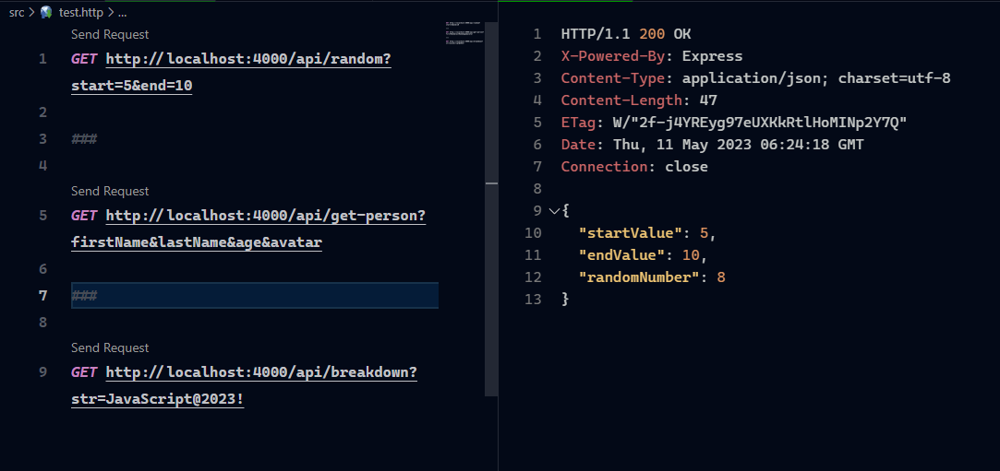
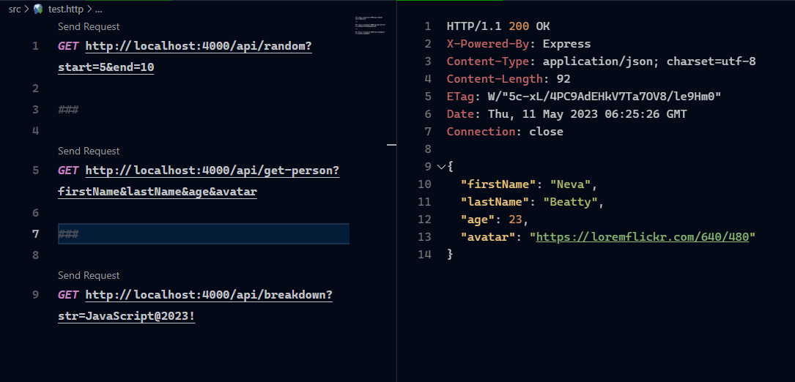
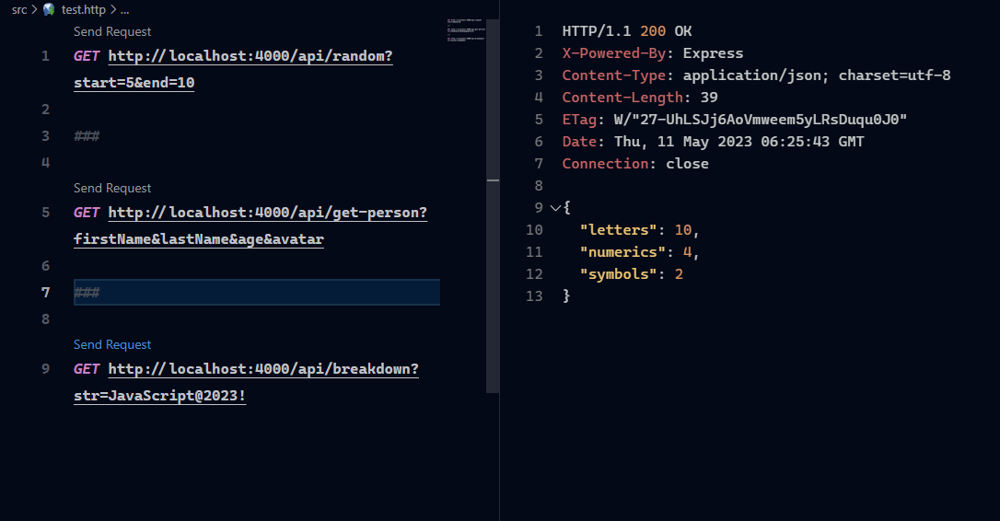

# Full Stack Army (Advance Backend) 🧠

## Assignment - 01 (Make our algorithm live using REST API) 📝

- [Full Stack Army (Advance Backend) 🧠](#full-stack-army-advance-backend-)
  - [Assignment - 01 (Make our algorithm live using REST API) 📝](#assignment---01-make-our-algorithm-live-using-rest-api-)
    - [Task - 01 📝](#task---01-)
      - [Solution - 01 📚](#solution---01-)
    - [Task - 02 📝](#task---02-)
      - [Solution - 02 📚](#solution---02-)
    - [Task - 03 📝](#task---03-)
      - [Solution - 03 📚](#solution---03-)
    - [API Logic Link 🔗](#api-logic-link-)
      - [Prepared By 🙋‍♂️](#prepared-by-️)

### Task - 01 📝

We have a function that can take two arguments called start and end. Both arguments will be a valid integer number. The function will return a random value in the given range.

#### Solution - 01 📚

- Business Logic Link: [generateRandomNumber](./src/business-logics/generateRandomNumber.js)
- Output

### Task - 02 📝

We have a function that can generate a fake person profile including first name, last name, email, avatar, age and address. User can pass an array of selected properties and it will return a person object containing only given properties. Ex: generatePerson([’firstName’, ‘lastName’, ‘email’]).

#### Solution - 02 📚

- Business Logic Link: [generatePerson](./src/business-logics/generatePerson.js)
- Output

### Task - 03 📝

We have a function that can accept a string as an argument and return an object containing the number of letters, number of symbols and number of numeric characters.

#### Solution - 03 📚

- Business Logic Link: [breakdownString](./src/business-logics/breakdownString.js)
- Output

### API Logic Link 🔗

[API Logic](./src/app.js)

#### Prepared By 🙋‍♂️

[Aditya Chakraborty](https://linktr.ee/adityackr)
